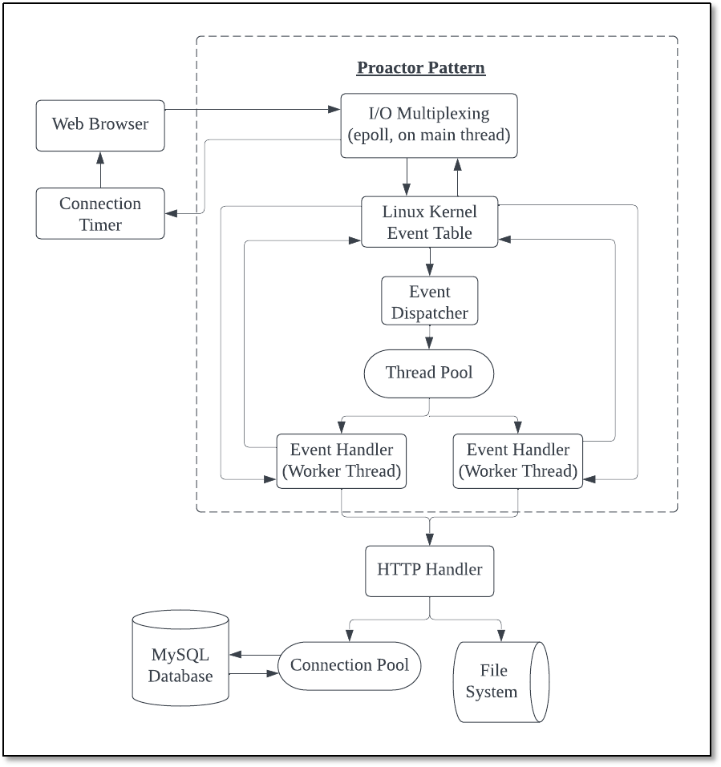

# A-Lightweight-Linux-Web-Server
## Overview
The goal of this project is to implement a lightweight Linux web server application that is capable of handling concurrent client connections efficiently.

Key features include:

- Leveraging Linux's epoll API for scalable non-blocking I/O event notification to enable asynchronous, non-blocking I/O operations.
- Implementing a simulated Proactor design pattern through synchronized I/O techniques to optimize concurrent request processing.
- Building an HTTP request parser to support parsing and handling of GET and POST requests from web clients.
- Creating a thread pool to efficiently distribute incoming HTTP requests across multiple threads for improved responsiveness under load.
- Integrating a MySQL database backend with connection pooling pattern to provide user registration, authentication, and login services while ensuring optimized database access.

## Architecture

## Running Instruction
**1. Develop & test environment**  
  
Ubuntu 20.04  
MySQL 5.7.30  
FireFox browser  
  
**2. Create and use MySQL database**  
  
`mysql -u root -p`   
`mysql -> CREATE DATABASE mydb`  
`USE mydb`  
`CREATE TABLE user( username char(50) NULL, passwd char(50) NULL ) ENGINE=InnoDB`  
`INSERT INTO user(username, passwd) VALUES('name', 'passwd')`  
  
**3. Modify line 123 in main.cpp**  
  
From `connPool->init("localhost", "root", "<my root server password>", "mydb", 6000, 8);`  
To `connPool->init("localhost", "root", "<your password>", "mydb", 6000, 8);`   
  
**4. Modify line 21 in http_handler.cpp**  
  
From `const char* doc_root = "<my directory of resource file>";`  
To  `const char* doc_root = "<your directory of resource file>";`  
  
**5. Make file and run server in terminal**  
  
`Make server`  
`./server port`  
  
**6. Input URL on browser**  
  
`localhost:port`  
  
## Reference
[1] Kerrisk, M. (2012) The linux programming interface: A linux and UNIX system programming handbook. San Francisco, CA: No Starch Press.   
[2] Stevens, W.R. (1998) Unix network programming. Upper Saddle River, NJ: Prentice Hall PTR.   
[3] 游双, Linux高性能服务器编程  
[4] Beej's Guide to Network Programming, https://beej.us/guide/bgnet/   
[5] linyacool, A C++ High Performance Web Server, https://github.com/linyacool/WebServer   
