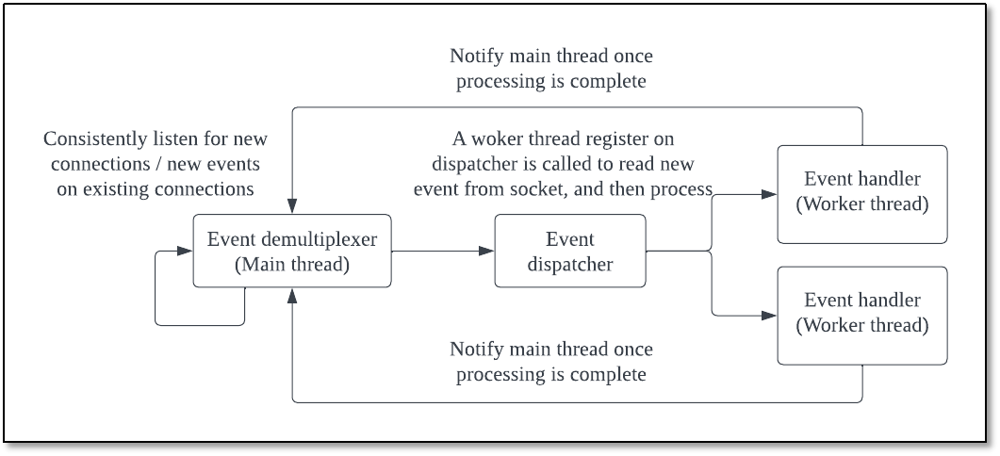
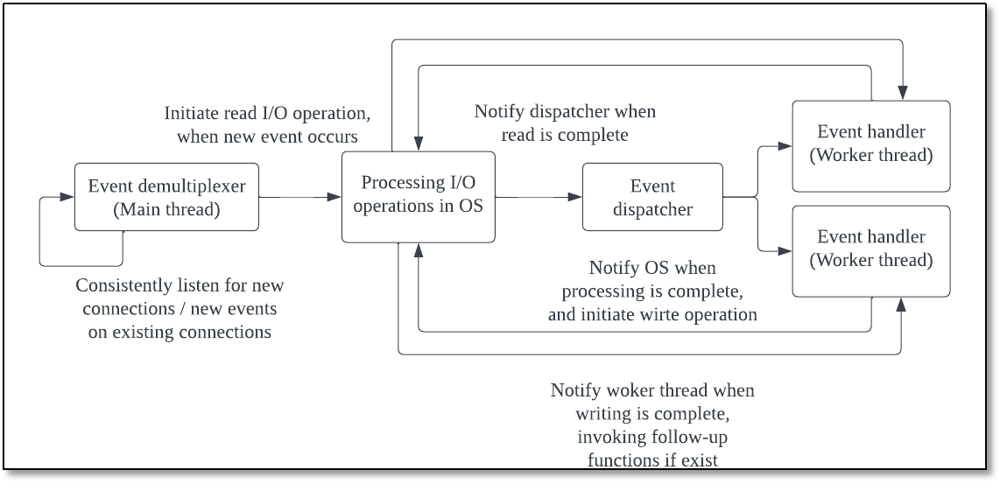

# A-Lightweight-Linux-Web-Server
## Overview
This is a learning-oriented project, aims to build a lightweight web server application, that can effectively handle concurrent clients.
- Employ Linux's Epoll, a high-performance I/O multiplexing API, to achieve efficient non-blocking I/O event notification.
- Develop a simulated Proactor pattern using synchronized I/O techniques to enhance system performance. 
- Create an HTTP parser to enable handling of both GET and POST requests from web browser users.
- Establish a thread pool mechanism to effectively manage concurrent HTTP requests and improve system responsiveness.
- Utilize a MySQL database in conjunction with a connection pool to offer registration, authentication, and login services to multiple concurrent users, ensuring data integrity and efficient access.
## Project Architecture

## Quick Demo 

## Running Instruction
**1. Develop & test environment**  
  
Ubuntu 20.04  
MySQL 5.7.30  
FireFox browser  
Webbench 1.5  
  
**2. Create and use MySQL database**  
  
`mysql -u root -p`   
`mysql -> CREATE DATABASE mydb`  
`USE mydb`  
`CREATE TABLE user( username char(50) NULL, passwd char(50) NULL ) ENGINE=InnoDB`  
`INSERT INTO user(username, passwd) VALUES('name', 'passwd')`  
  
**3. Modify line 123 in main.cpp**  
  
From `connPool->init("localhost", "root", "<my root server password>", "mydb", 6000, 8);`  
To `connPool->init("localhost", "root", "<your password>", "mydb", 6000, 8);`   
  
**4. Modify line 21 in http_handler.cpp**  
  
From `const char* doc_root = "/home/zhn/Desktop/WebServer/resource";`  
To  `const char* doc_root = "<your directory of resource file>";`  
  
**5. Make file and run server in terminal**  
  
`Make server`  
`./server port`  
  
**6. Input URL on browser**  
  
`localhost:port`  
  
**7. Test with webbench1.5**  
  
`gcc webbench.c -o webbench`  
`./webbench -c 5000 -t 5 http://localhost:9000/` // Where arg for -c is number of clients, for -t is time in seconds  

## Key Components for Concurrency
In this project, I went through several fundemantal techniques regarding concurrent server programming, and put them into practice. 
  
**1. The Linux I/O Multiplexing Mechanism: Epoll**  
  
The Linux epoll API is the foundation of the web server's I/O multiplexing mechanism. It enables the server to efficiently handle multiple simultaneous connections without incurring the overhead of one thread per connection. Epoll monitors multiple file descriptors to identify when they are ready for I/O operations, thus ensuring efficient utilization of server resources.
* **Edge-triggered (ET) and level-triggered (LT) modes:** epoll supports both ET and LT modes (switch by `epoll_ctl` function). In LT mode, if a file descriptor is ready for I/O, the event is signaled until the descriptor is read or written, even if it remains in the ready state. In ET mode, the event is signaled only when the descriptor transitions from a non-ready to a ready state. Each mode has its own strengths and weaknesses, and the decision of which is better depends on the specific requirements and characteristics of the system. 
In this project, only the LT mode is implemented. 
* **Scalability:** epoll uses a data structure (an epoll instance, created by `epoll_create` function) that can efficiently handle a large number of file descriptors. This structure allows the kernel to quickly identify which descriptors are ready for I/O without having to iterate through all of them.

**2. Concurrent Event Handling Pattern: Reactor and Proactor**  

In reactor pattern, the web server uses a event demultiplexer thread (typically the main thread) to handle all incoming events, such as network connections and data transfers. This thread is responsible for registering new event to a evennt dispatcher (an event table), and monitoring all events. When an event occurs, the main thread notifies the relevant server application to handle the event by calling a event handler (a worker thread) which was registered on the dispatcher, and inform this thread to read from socket and perform processing for the event, such as reading or writing data to the socket, and returns control to the thread to wait for the next event. 

Proactor pattern is another event handling pattern used in web servers to handle concurrent connections. The Reactor design pattern involves the event demultiplexer waiting for events to indicate when a file descriptor or socket is ready for a read or write operation. The appropriate handler then performs the read or write operation.
In contrast, the Proactor pattern involves the handler, or the event demultiplexer acting on behalf of the handler, initiating asynchronous read and write operations. The actual I/O operation is performed by the operating system, which receives parameters such as the addresses of user-defined data buffers from which it retrieves data to write or to which it stores read data. The event demultiplexer then waits for events indicating the completion of the I/O operation and forwards them to the appropriate handlers.
  

**3. Thread Pool**  
A thread pool is utilized to manage multiple worker threads that process incoming HTTP requests. By reusing a fixed number (corresponding to CPU cores) of threads, the web server avoids the overhead of dynamically creating and destroying threads for each incoming request. The worker threads process tasks from a shared task queue, which stores incoming HTTP requests. This approach ensures efficient utilization of server resources and maintains high throughput.
The `ThreadPool` class performs the following tasks:
- It allocates multiple threads statically during initialization, minimizing the overhead of frequently creating and deleting threads.
- The main thread listens on the server port for new HTTP requests.
- When a new request arrives, it is stored in a request queue (a list).
- A worker thread from the “ThreadPool” is then awakened to acquire and handle the new HTTP request from the request queue.

**4. MySQL Database and Connection Pool**
MySQL database is used to store user authentication data, enabling the web server to provide login services for concurrent users. The database connection pool manages multiple concurrent connections to the MySQL database, preventing performance degradation caused by establishing and closing database connections for each incoming request.
The `ConnectionPool` class performs the following tasks:
- Defined utilizing the Singleton pattern.
- The resources in the “ConnectionPool” consist of a set of statically allocated database connections that are dynamically used and released by the process.
- When the process requires database access, it obtains a free connection from the pool.
- After completing the database operation, the process releases the connection back to the pool.

**5. Connection Timer**
Connection timers are used to monitor and manage connections, ensuring optimal resource usage and server performance. They can detect idle connections and close them, freeing up resources for other active connections. 
The `ListTimer` class performs the following tasks:
- Create a list of timer using an ascending doubly-linked list, where timers are sorted by their expiration time from shortest to longest (head expires first, tail last). 
- Each connection's expiration time is 15 seconds from its initialization or last interaction with the server, with any data exchange resetting the timer. 
- The root process checks the timer list every 5 seconds, deeming connections that have timed out as inactive and closing them.

## Reference
[1] Kerrisk, M. (2012) The linux programming interface: A linux and UNIX system programming handbook. San Francisco, CA: No Starch Press. 
[2] Stevens, W.R. (1998) Unix network programming. Upper Saddle River, NJ: Prentice Hall PTR.   
[3] 游双, Linux高性能服务器编程  
[4] Beej's Guide to Network Programming, https://beej.us/guide/bgnet/   
[5] linyacool, A C++ High Performance Web Server, https://github.com/linyacool/WebServer   
[6] markparticle, C++ Linux WebServer, https://github.com/markparticle/WebServer

